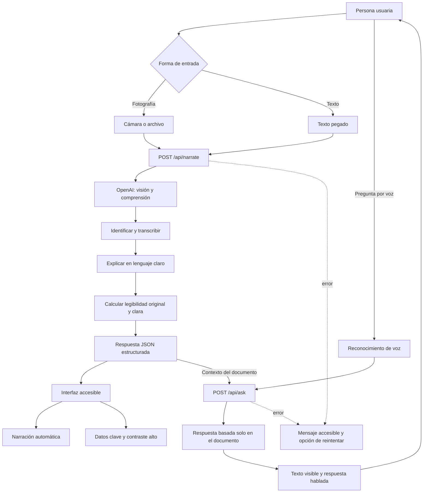
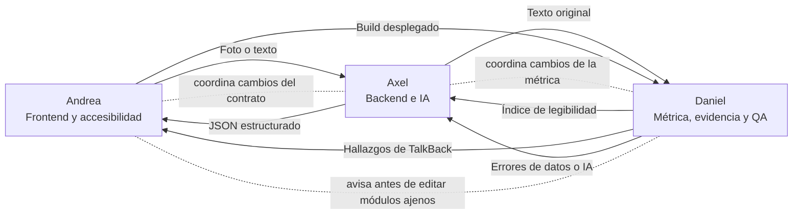

# ALIA — Resumen del proyecto y flujo del sistema

> **ALIA:** Accesibilidad, Lenguaje, Inclusión y Autonomía  
> **Lema:** *Tecnología que se adapta a ti.*

Este documento reúne el contexto operativo de ALIA, el reparto de responsabilidades del equipo y el flujo vigente del sistema. Para instalar y ejecutar la aplicación, consulta [`README.md`](../../README.md).

## 1. Qué es ALIA

ALIA es una aplicación web accesible que transforma documentos impresos o digitales en información fácil de escuchar, entender y consultar.

El MVP está dirigido principalmente a:

- Personas ciegas.
- Personas con baja visión.
- Adultos mayores con dificultades visuales.
- Personas con dificultades para leer o comprender textos complejos.

La persona fotografía un documento o pega su texto. ALIA identifica su contenido, lo explica en lenguaje claro, lo narra y permite realizar preguntas por voz.

El problema que aborda es la pérdida de autonomía y privacidad que ocurre cuando una persona necesita que alguien más lea documentos relacionados con su salud, pagos, educación, trámites o derechos.

## 2. Alcance del MVP

El prototipo debe completar este recorrido:

1. Capturar una fotografía o recibir texto pegado.
2. Enviar el documento a la inteligencia artificial.
3. Identificar el tipo de documento y transcribir su contenido.
4. Generar una explicación breve en lenguaje claro.
5. Calcular la legibilidad del texto original y de la explicación.
6. Narrar automáticamente el resultado.
7. Permitir preguntas por voz.
8. Responder únicamente con información presente en el documento.
9. Ofrecer una interfaz de alto contraste compatible con TalkBack.

Quedan fuera del MVP la lengua de señas, la traducción universal, el historial persistente y la accesibilización completa de portales gubernamentales.

## 3. Visión de crecimiento

ALIA no debe quedar limitada a la discapacidad visual. Su arquitectura futura puede incorporar diferentes formas de interacción:

| Necesidad | Adaptación posible |
|---|---|
| Discapacidad visual | Voz, alto contraste, texto ampliado y navegación con lector de pantalla |
| Dificultad lectora | Lenguaje claro, frases cortas y explicación paso a paso |
| Discapacidad cognitiva | Pictogramas, instrucciones secuenciales y reducción de carga cognitiva |
| Discapacidad auditiva | Texto, subtítulos, alertas visuales y lengua de señas en una fase futura |
| Discapacidad motriz | Navegación por voz, pocos controles y objetivos táctiles grandes |

La idea rectora es que la tecnología se adapte a cada persona, no que la persona deba adaptarse a la tecnología.

## 4. Tecnología

- Next.js 15 y React 19.
- TypeScript y Tailwind CSS 4.
- OpenAI `gpt-4o` para visión, extracción y lenguaje claro.
- Web Speech API para texto a voz y reconocimiento de voz.
- Índice Fernández-Huerta como evidencia cuantitativa de legibilidad.
- Vercel para despliegue con HTTPS.
- ODS 10 como objetivo principal y ODS 11 como objetivo secundario.

## 5. Flujo funcional del sistema



### Recorrido explicado

1. La interfaz recibe una foto o un texto.
2. `/api/narrate` envía el contenido a OpenAI.
3. El modelo devuelve el tipo de documento, una explicación clara, datos clave, la transcripción y el estado de legibilidad de la imagen.
4. El backend calcula el índice Fernández-Huerta antes y después de la simplificación.
5. El frontend presenta el resultado y lo narra automáticamente.
6. La persona formula una pregunta mediante el micrófono.
7. `/api/ask` recibe la pregunta y el contexto del documento.
8. La respuesta aparece en pantalla y se reproduce por voz.
9. Si la respuesta no está en el documento, ALIA debe decirlo y no inventar información.

## 6. Contrato vigente entre frontend y backend

El código actual es la fuente definitiva del contrato. No se deben cambiar estos campos sin coordinar a Andrea y Axel.

### `POST /api/narrate`

Entrada:

```json
{
  "imageBase64": "opcional",
  "mediaType": "image/jpeg",
  "texto": "opcional"
}
```

Debe enviarse una imagen o un texto. La respuesta vigente es:

```json
{
  "tipoDocumento": "planilla de agua potable",
  "resumenClaro": "Explicación breve para ser escuchada.",
  "datosClave": [
    { "etiqueta": "Monto", "valor": "doce dólares con cincuenta" }
  ],
  "textoCompleto": "Transcripción del documento",
  "legible": true,
  "legibilidad": {
    "original": { "indice": 34, "etiqueta": "difícil" },
    "claro": { "indice": 88, "etiqueta": "fácil" }
  }
}
```

### `POST /api/ask`

Entrada:

```json
{
  "pregunta": "¿Cuánto tengo que pagar?",
  "contexto": "Texto completo y resumen del documento"
}
```

Salida:

```json
{
  "respuesta": "Debes pagar doce dólares con cincuenta."
}
```

Los errores de ambas rutas utilizan:

```json
{
  "error": "Mensaje del problema"
}
```

## 7. División de los tres agentes

### Andrea — Frontend y accesibilidad

Su objetivo es que la aplicación pueda utilizarse sin mirar la pantalla y resulte cómoda para una persona con baja visión.

Archivos principales:

- `app/page.tsx`
- `app/layout.tsx`
- `app/globals.css`
- `components/*`
- `lib/speech.ts`

Responsabilidades:

- Captura de fotografías y entrada de texto.
- Estados de carga, error y resultado.
- Narración automática y reconocimiento de voz.
- Modo de baja visión.
- Compatibilidad con TalkBack.
- Foco visible, controles de al menos 64 píxeles y regiones `aria-live`.
- Pruebas en Chrome móvil y despliegue en Vercel.

### Axel — Backend e inteligencia artificial

Su objetivo es transformar documentos reales en explicaciones breves, naturales, verificables y fáciles de escuchar.

Archivos principales:

- `app/api/narrate/route.ts`
- `app/api/ask/route.ts`
- `lib/openai.ts`
- `.env.local`, sin incluirlo en Git

Responsabilidades:

- Integración con OpenAI.
- Procesamiento de imágenes y texto.
- Prompts y esquema estructurado.
- Manejo de documentos borrosos.
- Preguntas y respuestas basadas únicamente en el documento.
- Integración de la métrica creada por Daniel.
- Configuración de `OPENAI_API_KEY` local y en Vercel.

### Daniel — Métrica, investigación, QA y pitch

Su objetivo es aportar evidencia, validar la experiencia real y asegurar un plan de respaldo para la presentación.

Archivos principales:

- `lib/readability.ts`
- `docs/*`
- Diapositivas y video de respaldo

Responsabilidades:

- Calibrar el índice Fernández-Huerta.
- Conseguir documentos reales o anonimizados de Portoviejo.
- Verificar cifras de INEC y CONADIS.
- Preparar antecedentes, diapositivas y guion.
- Ejecutar QA con TalkBack.
- Corregir o reportar problemas de accesibilidad.
- Grabar el video de respaldo y cronometrar la presentación.

Puede ayudar en otros módulos, pero debe avisar a Andrea o Axel antes de modificar sus archivos.

## 8. Flujo de responsabilidades



## 9. Reglas para evitar conflictos

1. Cada archivo tiene un propietario principal.
2. Nadie cambia el contrato JSON sin coordinar frontend y backend.
3. Daniel lidera cifras, antecedentes y pitch; Axel valida la parte técnica.
4. Daniel puede corregir código ajeno después de avisar al propietario.
5. Los controles interactivos deben medir al menos 64 píxeles.
6. La demo de reconocimiento de voz debe realizarse en Chrome.
7. La cámara móvil debe probarse sobre HTTPS mediante Vercel.
8. Ninguna cifra entra al pitch sin fuente verificable.
9. ALIA nunca inventa datos que no aparecen en el documento.
10. No se debe ampliar el alcance del MVP durante la hackatón.

## 10. Agentes especialistas adicionales

Además de los tres agentes del equipo existen dos agentes especializados de Codex en `.codex/agents/`:

- `prompt-lab.toml`: revisa y mejora los prompts de narración y preguntas.
- `ux-accesible.toml`: audita semántica, contraste, foco, etiquetas, anuncios y controles táctiles.

Estos asistentes apoyan a Axel y Andrea respectivamente; no reemplazan la propiedad de sus módulos.

## 11. Aclaraciones sobre documentos anteriores

- El contrato descrito en `docs/AGENTE-AXEL.md` contiene nombres antiguos como `resumenHablado`, `respuestaHablada` y `legibilidadAntes`. Debe utilizarse el contrato documentado aquí y en el código actual.
- `lib/readability.ts` pertenece a Daniel. Axel lo integra desde `/api/narrate`.
- Daniel lidera la investigación y el pitch; Axel apoya con validación técnica.
- La medida mínima oficial de los controles para ALIA es 64 píxeles.
- Algunas instrucciones mencionan `~/proyectos/ALIA`; la ubicación de cada copia del repositorio dependerá del equipo y no debe asumirse dentro del código.

## 12. Puntos de sincronización

| Hora | Resultado esperado |
|---|---|
| 0:30 | Primer despliegue funcional en Vercel |
| 2:00 | Foto o texto produce una narración |
| 4:00 | Pregunta por voz produce una respuesta hablada |
| 5:00 | Video de respaldo grabado |
| 5:45 | Demo y pitch completos en tres minutos o menos |

## 13. Criterio de éxito

ALIA está lista para la demostración cuando una persona puede completar, con la menor ayuda visual posible, este recorrido:

> Fotografiar un documento → escuchar qué significa → conocer sus datos importantes → preguntar algo por voz → recibir una respuesta confiable.
